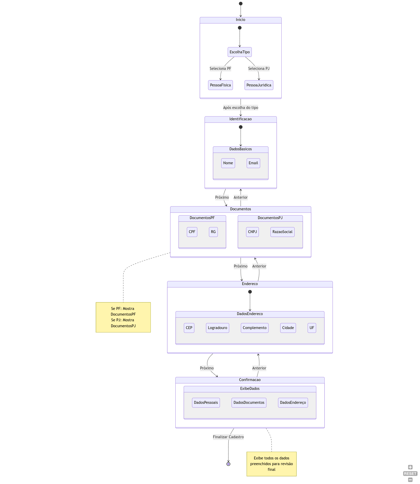
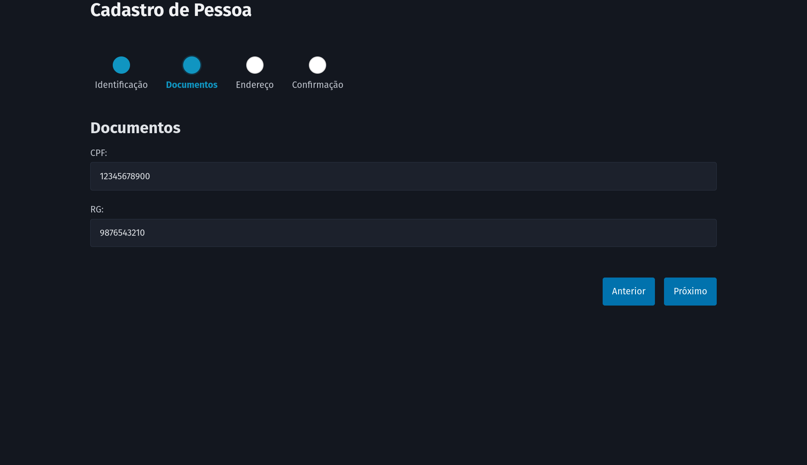

# form-wizard-state-machine

Form Wizard made with AlpineJS and apply State Machine Pattern

## Rodando a aplicação

```python
git clone https://github.com/rg3915/form-wizard-state-machine.git

cd form-wizard-state-machine

python -m http.server
```

Ou rode com [livereload](https://www.npmjs.com/package/livereload)

Ou com [http-server](https://www.npmjs.com/package/http-server)







Leia mais em

* [State by Refactoring Guru](https://refactoring.guru/pt-br/design-patterns/state)
* [State Design Pattern by Mario Example](https://www.ashishvishwakarma.com/GoF-Design-Patterns-by-Example/State-Pattern/).

